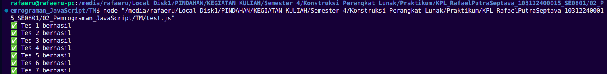

# Tugas Mandiri 02: Pemrograman JavaScript

Nama: Rafael Putra Septava  
NIM: 103122400015  
Kelas: SE0801  

## Tugas

Buatlah sebuah fungsi bernama fizzBuzz yang menerima input larik (array) dan mengembalikan deretan bilangan dan "Fizz" untuk kelipatan 2, "Buzz" untuk kelipatan 7, dan "FizzBuzz" untuk kelipatan 14. Beri nama berkas program sebagai tm.js dan taruh di direktori TM.

## Program/Kode

Tersedia di [tm.js](https://github.com/RafaelSeptava/KPL_RafaelPutraSeptava_103122400015_SE0801/blob/main/02_Pemrograman_JavaScript/TM/tm.js), [test.js](https://github.com/RafaelSeptava/KPL_RafaelPutraSeptava_103122400015_SE0801/blob/main/02_Pemrograman_JavaScript/TM/test.js)

## Output

 

## Deskripsi 

Program ini menjalankan fungsi fizzBuzz yang tujuannya untuk memproses nilai yang berada dalam array yang berisi angka. Program memeriksa angka jika angka habis dibagi 14 maka diganti dengan teks "fizzBuzz". Jika angka habis dibgai 7 maka diganti teks "Buzz". Jika angka habis dibgai 2 maka diganti teks "Fizz". Jika tidak menampilkan ketiga kondisi, maka akan mengembalikan angka biasa. Jika input bukan berupa array, maka mengembalikan pesan "Input tidak valid".