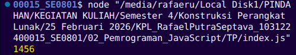

Tugas Pendahuluan 02: Pemrograman JavaScript

Soal

Kamu sudah menulis fungsi mulOfArray. Ujilah dengan input [2, 0, 26, 28, -2], dengan output yang seharusnya adalah 1456. Jika kamu menemukan bahwa hasilnya berbeda, bisakah kamu memperbaikinya? Jika kamu menemukan bahwa hasilnya sama, bisakah kamu menjelaskan mengapa demikian?

Kode sumber

Tersedia di [index.js](https://github.com/RafaelSeptava/KPL_RafaelPutraSeptava_103122400015_SE0801/blob/main/02_Pemrograman_JavaScript/TP/index.js)

Output

 

Deskripsi Program

Program ini menjalankan perkalian semua bilangan positif dalam larik (array). Ini akan bekerja untuk bilangan positif lebih dari atau sama dengan 1 (>= 1).