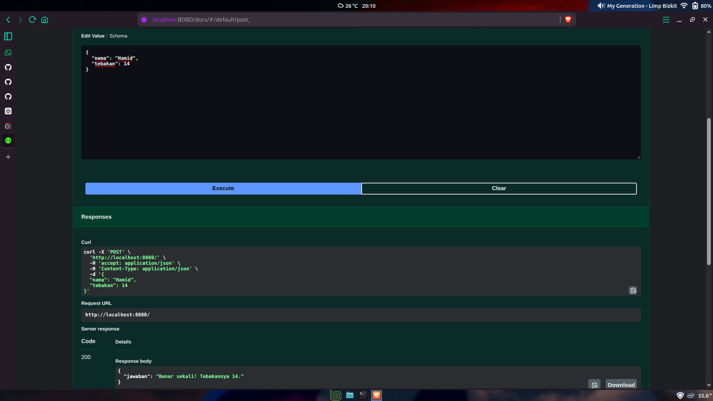

# Tugas Mandiri 09: API Design dan Construction Using Swagger

Nama : Rafael Putra Septava  
NIM  : 103122400015  
Kelas: SE0801  

## Tugas

Mari kita main tebak-tebakan angka acak!

Tugasmu adalah membuat API yang terdiri dari satu endpoint saja, yaitu POST /. Ketika kita melakkukan POST, formatnya adalah seperti di bawah ini.

{
  "nama": "Hamid",
  "tebakan": 24
}

Jika tebakan benar.

{
    "jawaban": "Benar sekali! Tebakannya adalah 24."
}

Jika tebakan terlalu tinggi.

{
    "jawaban": "Tebakanmu terlalu tinggi!"
}

Jika tebakan terlalu rendah.

{
    "jawaban": "Tebakanmu terlalu rendah!"
}

Beberapa aturan:

1. Angka acak yang dihasilkan harus tetap dan tidak boleh berubah setiap kali permintaan API dilakukan, tetapi boleh berubah setiap harinya atau dibuat tetap selamanya  
2. Rentang harus di antara 1-100  
3. Nama harus sensitif terhadap besar kecil huruf (mis. hamid dan Hamid akan menghasilkan angka acak yang berbeda)  
4. Tidak menggunakan pustaka apapun, murni mengandalkan nama dan tebakan  

Penjelasan untuk nomor 1: Jika namanya Hamid, ia akan diharapkan tetap pada nilai tebakan 24 mau kamu melakukan 100 kali permintaan. Tidak ada jawaban benar di sini (Hamid tidak harus 24, bebas mau dibuat acak seperti apa yang penting harus tetap).

## Program/Kode

tersedia di [app.js](https://github.com/RafaelSeptava/KPL_RafaelPutraSeptava_103122400015_SE0801/blob/main/09_API_Design_dan_Construction_Using_Swagger/TM/app.js), [swagger.js](https://github.com/RafaelSeptava/KPL_RafaelPutraSeptava_103122400015_SE0801/blob/main/09_API_Design_dan_Construction_Using_Swagger/TM/swagger.js)

## Output

## Deskripsi

Program membuat permainan tebak angka dari pendekatan input pengguna. Sistem akan membuat angka rahasia secara acak. Endpoint menerima data berupa nama dan tebakan, lalu membandingkan angka tebakan itu dengan angka rahasia. Jika angka tebakan lebih besar dari angka rahasia akan memunculkan input "Tebakanmu terlalu tinggi!". Jika angka tebakan lebih kecil dari angka rahasia akan memunculkan input "Tebakanmu terlalu rendah!". Jika angka tebakan sesuai dengan angka rahasia akan memunculkan kalimat jawaban benar.